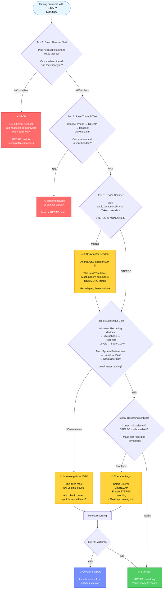
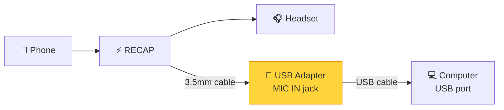

## The 5-Minute Diagnostic

**Use this flowchart to diagnose ANY problem with RECAP.**

Run tests IN ORDER. Don't skip steps.

### Diagnostic Flowchart

**How to use this flowchart:**

1. Start at the top
2. Follow each test in order
3. Yellow boxes = Action needed (fix something)
4. Green box = Success!
5. Red boxes = Stop and get different equipment

---

## The USB Adapter Solution

### When You Need It

**You need a USB stereo adapter if:**

- Device scanner shows "MONO input detected"
- Your computer has no MIC IN port (only LINE IN or combo port)
- Pass-through test works but recording fails
- You have a modern laptop or Mac (most made after 2015 are MONO-only)

### Why This Happens

**RECAP outputs stereo audio (2 channels):**

- One channel = Your voice
- Other channel = Their voice
- ⚠️ Channel assignment (L/R) may vary depending on USB adapter

**Your computer needs stereo input to record both channels.**

Most modern computers save cost by including only MONO microphone inputs. This captures only ONE channel (one-sided audio or no audio).

**This is NOT a RECAP defect** - it's a common computer compatibility issue.

### Recommended Solution: Andrea USB Adapter

**Product:** Andrea USB-SA Audio Adapter
- **Cost:** $20-40 USD
- **Where to buy:** Amazon, B&H Photo, electronics retailers
- **Search for:** "Andrea USB stereo microphone adapter"

**Why we recommend this specific adapter:**

- ✅ Guaranteed stereo microphone input (2 channels)
- ✅ Plug-and-play (no drivers needed)
- ✅ Works on Windows, Mac, Linux
- ✅ Provides proper bias voltage for RECAP
- ✅ Tested and confirmed compatible

### How to Use USB Adapter

**Connections:**

**Setup steps:**

1. Plug USB adapter into computer's USB port
2. Connect RECAP's output to USB adapter's MIC IN jack
3. Computer will automatically recognize "USB Audio Device"
4. In recording software, select "USB Audio Device" as input
5. Test recording - should now capture both channels

**That's it!** The USB adapter gives your computer a true stereo microphone input.

### Alternative USB Adapters

If Andrea adapter unavailable, look for:

**Required features:**

- **Stereo microphone input** (2 channels) - most important
- Bias voltage for external microphones
- Specifications mention "stereo mic input" or "2-channel input"

**NOT compatible:**

- USB adapters with only LINE IN
- USB adapters with only MONO mic input (1 channel)
- Bluetooth adapters (too much latency for real-time)

---

