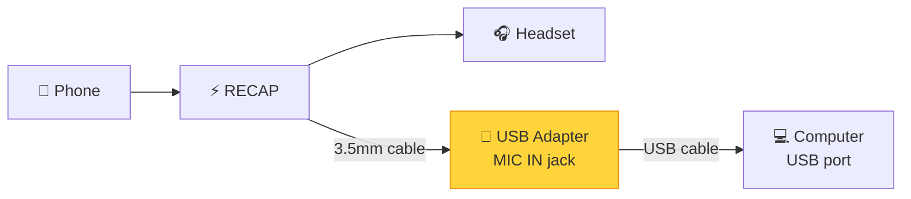

## The 5-Minute Diagnostic

**Use this flowchart to diagnose ANY problem with RECAP.**

Run tests IN ORDER. Don't skip steps.

### Diagnostic Flowchart

```mermaid
flowchart TD
    Start([Having problems with RECAP?<br/>Start here]) --> Test1{Test 1: Direct Headset Test<br/><br/>Plug headset into phone<br/>Make test call<br/><br/>Can you hear them?<br/>Can they hear you?}

    Test1 -->|NO to either| BadHeadset[❌ STOP<br/><br/>Get different headset<br/>Old headsets from drawers<br/>often don't work<br/><br/>RECAP can't fix<br/>incompatible headsets]

    Test1 -->|YES to both| Test2{Test 2: Pass-Through Test<br/><br/>Connect Phone → RECAP → Headset<br/>Make test call<br/><br/>Can you hear call<br/>in your headset?}

    Test2 -->|NO| TryHeadset[Try different headset<br/>or contact support<br/><br/>May be RECAP defect]

    Test2 -->|YES| Test3{Test 3: Device Scanner<br/><br/>Visit: audio.recapmycalls.com<br/>Take screenshot<br/><br/>STEREO or MONO input?}

    Test3 -->|MONO| USBAdapter[✅ USB Adapter Needed<br/><br/>Andrea USB adapter $20-40<br/><br/>This is NOT a defect<br/>Most modern computers<br/>have MONO inputs<br/><br/>Get adapter, then continue]

    Test3 -->|STEREO| Test3B{Test 3B: Check Device Settings<br/><br/>Click device to expand details<br/><br/>Echo Cancellation OFF?<br/>Noise Suppression OFF?<br/>Auto Gain Control OFF?}

    Test3B -->|Features ON| FixInterference[⚠️ Disable Interference<br/><br/>Turn OFF these features:<br/>• Echo Cancellation<br/>• Noise Suppression<br/>• Auto Gain Control<br/><br/>These can merge or kill channels!]

    Test3B -->|All OFF| Test3C{Test 3C: Baseline Test<br/><br/>Test with standard<br/>stereo microphone<br/><br/>Does computer record<br/>stereo audio at all?}

    Test3C -->|NO| FixBaseline[⚠️ Fix Computer Setup<br/><br/>Problem is NOT RECAP!<br/>Computer can't record stereo.<br/><br/>Check:<br/>• Using MIC IN port not LINE IN<br/>• Recording software set to STEREO<br/>• Correct input device selected]

    Test3C -->|YES or No stereo mic| Test4{Test 4: Audio Input Gain<br/><br/>Windows: Recording devices<br/>→ Microphone → Properties<br/>→ Levels → Set to 100%<br/><br/>Mac: System Preferences<br/>→ Sound → Input<br/>→ Drag slider right<br/><br/>Level meter moving?}

    FixInterference --> Test3C
    FixBaseline --> Test4

    Test4 -->|NO movement| FixGain[✅ Increase gain to 100%<br/><br/>This fixes most<br/>low volume issues!<br/><br/>Also check: correct<br/>input device selected?]

    Test4 -->|YES| Test5{Test 5: Recording Software<br/><br/>Correct mic selected?<br/>STEREO mode enabled?<br/><br/>Make test recording<br/>Play it back}

    Test5 -->|Problems| FixSoftware[✅ Check settings:<br/><br/>- Select External Mic/RECAP<br/>- Enable STEREO recording<br/>- Close apps using mic]

    Test5 -->|Works| Success[✅ Success!<br/><br/>RECAP is working<br/>You're ready to record]

    FixGain --> Retest1[Retest recording]
    FixSoftware --> Retest1
    USBAdapter --> Test4
    Retest1 --> StillBroken{Still not working?}
    StillBroken -->|YES| ContactSupport[📧 Contact Support<br/><br/>Include results from<br/>all 5 tests above]
    StillBroken -->|NO| Success

    style BadHeadset fill:#ff6b6b,stroke:#c92a2a,color:#fff
    style TryHeadset fill:#ff6b6b,stroke:#c92a2a,color:#fff
    style USBAdapter fill:#ffd43b,stroke:#f08c00,color:#000
    style FixInterference fill:#ffd43b,stroke:#f08c00,color:#000
    style FixBaseline fill:#ffd43b,stroke:#f08c00,color:#000
    style FixGain fill:#ffd43b,stroke:#f08c00,color:#000
    style FixSoftware fill:#ffd43b,stroke:#f08c00,color:#000
    style Success fill:#51cf66,stroke:#2f9e44,color:#fff
    style ContactSupport fill:#748ffc,stroke:#4c6ef5,color:#fff
    style Start fill:#e7f5ff,stroke:#339af0,color:#000
```

**How to use this flowchart:**

1. Start at the top
2. Follow each test in order
3. Yellow boxes = Action needed (fix something)
4. Green box = Success!
5. Red boxes = Stop and get different equipment

---

## Test 3B: Checking Device Settings (Critical!)

**After scanner shows STEREO, don't celebrate yet!** Modern audio devices have "enhancement" features that can interfere with RECAP.

### How to Check Device Settings

1. On the scanner page, **click on the device name** (e.g., "Microphone (Realtek Audio)")
2. The device card will expand to show detailed settings
3. Look for these features and their status:

**Interference Features (should be OFF):**

- **Echo Cancellation** - Designed to remove echo, but may suppress one channel thinking it's an echo
- **Noise Suppression** - Filters background noise, but can kill quiet voices or merge channels
- **Auto Gain Control (AGC)** - Automatically adjusts volume, but may apply different gain to each channel

**Common problems when these are ON:**

- One-sided recording (only hear yourself OR only hear them)
- Merged channels (both sides mixed into mono)
- Inconsistent volume levels
- Audio dropouts or distortion

### How to Fix Interference

**Option 1: Via Audio Scanner (if supported)**

- Use the toggle switches in the expanded device view
- Turn OFF Echo Cancellation, Noise Suppression, and Auto Gain Control
- Adjust gain sliders to desired level (usually 80-100%)

**Option 2: Via Operating System Settings**

**Windows:**

1. Right-click speaker icon → "Sounds"
2. Go to "Recording" tab
3. Select the device → "Properties"
4. **Enhancements tab** → Check "Disable all enhancements" OR uncheck specific features
5. **Levels tab** → Set microphone to 80-100%
6. Click OK

**Mac:**

1. System Preferences → Sound → Input
2. Select the device
3. **Note:** Mac has fewer audio processing options than Windows
4. If issues persist, may need USB adapter for cleaner signal

### Using the VU Meters

While on the scanner page with device expanded:

1. Make a test phone call
2. Speak into your headset microphone
3. **Watch the VU meter bars** (visual level indicators)
4. Both L and R channels should show movement when speaking
5. If only one bar moves, you have a channel interference problem

---

## Test 3C: Baseline Stereo Test (Critical!)

**Before troubleshooting RECAP further, verify your computer can record stereo audio at all.**

Many customers have NEVER successfully recorded stereo audio on their computer before using RECAP. If the computer/software isn't configured correctly, RECAP won't work either.

### Why This Test Matters

**The problem:** You might be blaming RECAP when your computer was never set up for stereo recording in the first place.

**Common issues this catches:**
- RECAP plugged into LINE IN (no microphone power)
- Recording software defaulting to MONO mode
- Wrong port selected in recording software
- Computer genuinely lacks stereo capability (scanner false positive)

### How to Perform Baseline Test

**You'll need:** A stereo microphone (options below)

**Test procedure:**

1. **Unplug RECAP temporarily**
2. **Plug in a stereo microphone** to the same port you were using for RECAP
3. **Open your recording software** (Audacity, Sound Recorder, etc.)
4. **Set recording mode to STEREO** (not mono!) - this is critical
5. **Record yourself speaking** for 10 seconds
6. **Play it back**

### What Qualifies as a Stereo Microphone?

**Good options for baseline test:**

- **Phone earbuds with mic** (iPhone, Android earbuds) - Most are stereo
- **Gaming headset** - Usually stereo
- **USB conference mic** - Check specs for stereo support
- **Laptop built-in mic** (if it has one) - Often stereo on modern laptops
- **Any mic labeled "stereo"** on the packaging

**NOT stereo (don't use for this test):**

- Basic karaoke mic
- Old computer mic from 2000s
- Single-element microphones

**Don't have a stereo mic?** You can skip this test and continue to Test 4, but if RECAP doesn't work, you'll need to come back and verify with a stereo mic before claiming RECAP is defective.

### Interpreting Results

**✅ Baseline test PASSED (stereo mic recorded successfully):**
- Your computer CAN record stereo
- Your recording software is configured correctly
- The port works and has proper voltage
- **Conclusion:** Issue is specific to RECAP setup (headset compatibility, connections, etc.)
- **Next step:** Continue to Test 4

**❌ Baseline test FAILED (stereo mic did NOT record):**
- **Problem is NOT RECAP!** Your computer can't record stereo from ANY device
- **Common causes:**
  - Using LINE IN port instead of MIC IN port
  - Recording software set to MONO mode
  - Wrong input device selected in software
  - Gain set to 0%
  - Scanner incorrectly reported STEREO (actually MONO)
- **Next step:** Fix computer setup BEFORE trying RECAP again

### How to Fix Failed Baseline

If baseline test failed, fix these issues:

**Check port type:**
- Pink jack = MIC IN ✅ (correct)
- Blue jack = LINE IN ❌ (no mic power)
- Green jack = Speaker/Headphone OUT ❌ (wrong)

**Check recording software:**
- Audacity: Audio Setup → Recording Channels → **2 (Stereo)**
- Sound Recorder (Windows): Should auto-detect, but check input device selection
- QuickTime (Mac): File → New Audio Recording → Click dropdown next to record button → Select stereo device

**Check input device:**
- Recording software must select the correct device
- Don't use "Default" - explicitly select the stereo-capable device
- If using USB adapter, select "USB Audio Device" not "Realtek"

**Check gain:**
- Windows: Sounds → Recording → Device → Properties → Levels → 80-100%
- Mac: System Preferences → Sound → Input → Input volume slider to right

---

## The USB Adapter Solution

### When You Need It

**You need a USB stereo adapter if:**

- Device scanner shows "MONO input detected"
- Your computer has no MIC IN port (only LINE IN or combo port)
- Pass-through test works but recording fails
- You have a modern laptop or Mac (most made after 2015 are MONO-only)

### Why This Happens

**RECAP outputs stereo audio (2 channels):**

- One channel = Your voice
- Other channel = Their voice
- ⚠️ Channel assignment (L/R) may vary depending on USB adapter

**Your computer needs stereo input to record both channels.**

Most modern computers save cost by including only MONO microphone inputs. This captures only ONE channel (one-sided audio or no audio).

**This is NOT a RECAP defect** - it's a common computer compatibility issue.

### Recommended Solution: Andrea USB Adapter

**Product:** Andrea USB-SA Audio Adapter
- **Cost:** $20-40 USD
- **Where to buy:** Amazon, B&H Photo, electronics retailers
- **Search for:** "Andrea USB stereo microphone adapter"

**Why we recommend this specific adapter:**

- ✅ Guaranteed stereo microphone input (2 channels)
- ✅ Plug-and-play (no drivers needed)
- ✅ Works on Windows, Mac, Linux
- ✅ Provides proper bias voltage for RECAP
- ✅ Tested and confirmed compatible

### How to Use USB Adapter

**Connections:**

**Setup steps:**

1. Plug USB adapter into computer's USB port
2. Connect RECAP's output to USB adapter's MIC IN jack
3. Computer will automatically recognize "USB Audio Device"
4. In recording software, select "USB Audio Device" as input
5. Test recording - should now capture both channels

**That's it!** The USB adapter gives your computer a true stereo microphone input.

### Alternative USB Adapters

If Andrea adapter unavailable, look for:

**Required features:**

- **Stereo microphone input** (2 channels) - most important
- Bias voltage for external microphones
- Specifications mention "stereo mic input" or "2-channel input"

**NOT compatible:**

- USB adapters with only LINE IN
- USB adapters with only MONO mic input (1 channel)
- Bluetooth adapters (too much latency for real-time)

---

