## How RECAP Works

### What RECAP Does

RECAP is a hardware audio converter. It transforms phone headset audio into a format your computer can record.

**Audio flow:**

```mermaid
flowchart LR
    Phone[📱 YOUR PHONE<br/><br/>Phone call audio]
    RECAP[⚡ RECAP S2<br/><br/>Converts to stereo mic:<br/>Channel 1 = Your voice<br/>Channel 2 = Their voice]
    Headset[🎧 HEADSET<br/><br/>You hear call<br/>in real-time]
    Computer[💻 COMPUTER<br/><br/>Records stereo input<br/>Saves both sides]

    Phone -->|Headset audio| RECAP
    RECAP -->|Pass-through| Headset
    RECAP -->|Stereo microphone| Computer

    style Phone fill:#e7f5ff,stroke:#339af0
    style RECAP fill:#fff3bf,stroke:#f08c00
    style Headset fill:#d3f9d8,stroke:#2f9e44
    style Computer fill:#e7f5ff,stroke:#339af0
```

### Technical Details

**Input (Phone Plug):**

- 3.5mm TRRS connector (4-pole)
- Standard: AHJ (American Headset Jack)
- Receives both mic audio (from headset) and speaker audio (to headset)

**Pass-Through (Headset Jack):**

- 3.5mm TRRS connector (4-pole)
- Identical to phone plug
- Allows you to hear call in real-time

**Output (MIC Jack):**

- 3.5mm TRS connector (3-pole stereo)
- Pin 1 (Tip): Right channel - Other person's voice (1kΩ impedance)
- Pin 2 (Ring): Left channel - Your voice (1kΩ impedance)
- Pin 3 (Sleeve): Ground
- Requires 700-2000mV bias voltage (standard for computer MIC IN)
- ⚠️ **Note:** Some USB adapters may swap L/R channels - verify which is which in your recording

**Power:**

- No batteries required
- Powered by computer's microphone bias voltage

---

