## How RECAP Works

### What RECAP Does

RECAP is a hardware audio converter. It sits between your phone and your headset, and it does two things at once:

1. **Passes call audio through to your headset** — so you can talk normally, as if RECAP wasn't there.
2. **Sends a separate recording output to your computer** — this is where both sides of the conversation are captured for recording.

These are two independent outputs. They carry different signals. Understanding this distinction is key to troubleshooting any audio issue.

**Audio flow:**

```mermaid
flowchart LR
    Phone[📱 YOUR PHONE<br/><br/>Phone call audio]
    RECAP[⚡ RECAP S2<br/><br/>Converts to stereo mic:<br/>Channel 1 = Your voice<br/>Channel 2 = Their voice]
    Headset[🎧 HEADSET<br/><br/>You hear call<br/>in real-time]
    Computer[💻 COMPUTER<br/><br/>Records stereo input<br/>Saves both sides]

    Phone -->|Headset audio| RECAP
    RECAP -->|Pass-through| Headset
    RECAP -->|Stereo microphone| Computer

    style Phone fill:#e7f5ff,stroke:#339af0
    style RECAP fill:#fff3bf,stroke:#f08c00
    style Headset fill:#d3f9d8,stroke:#2f9e44
    style Computer fill:#e7f5ff,stroke:#339af0
```

---

### Two Outputs, Two Different Signals

This is the most important thing to understand about RECAP. It has **two outputs** and they work completely differently:

#### Output 1: Pass-Through (Headset Jack)

The pass-through sends your phone's call audio straight to your headset. RECAP does not modify, split, or process this signal in any way. It is **identical** to plugging your headset directly into your phone.

- You hear the caller in **both ears**, same as without RECAP
- The caller hears you through the headset mic, same as without RECAP
- The audio is **mono** (same sound in left and right ear) — this is normal for phone calls
- If you unplugged the recording cable and never connected a computer, the pass-through would still work exactly the same

**Example:** You're on a call with a client. You hear their voice in both ears of your headset, they hear your voice through the headset mic. You talk normally. From a call quality perspective, nothing has changed — RECAP is invisible.

**If you only hear in one ear through the headset pass-through, something is physically wrong.** This is not a RECAP behavior — it's a connection issue, a headset issue, or a cable issue. See troubleshooting below.

#### Output 2: Recording Output (MIC Jack)

This is the separate cable that goes from RECAP to your computer (or voice recorder). This output is where RECAP does its real work — it captures both sides of the conversation and splits them into a **stereo signal**:

- **Left channel** = your voice (picked up from the headset mic)
- **Right channel** = the caller's voice (picked up from the phone's audio)

This stereo split is intentional. It's the whole point of RECAP — it gives you clean, separated audio that you can edit, transcribe, or process independently.

**Example:** You record a 30-minute interview. When you open the recording in Audacity or any audio editor, you see two channels. Left channel is you, right channel is the interviewee. You can adjust volume on each independently, remove background noise from one side without affecting the other, or export just the caller's audio.

⚠️ **The stereo split only exists on the recording output.** It has nothing to do with what you hear in your headset during the call.

---

### Technical Details

**Input (Phone Plug):**

- 3.5mm TRRS connector (4-pole)
- Standard: AHJ (American Headset Jack)
- Receives both mic audio (from headset) and speaker audio (to headset)

**Pass-Through (Headset Jack):**

- 3.5mm TRRS connector (4-pole)
- Identical to phone plug
- Transparent — forwards phone audio to headset unchanged
- Your headset hears exactly what it would hear plugged directly into the phone

**Output (MIC Jack):**

- 3.5mm TRS connector (3-pole stereo)
- Pin 1 (Tip): Right channel - Other person's voice (1kΩ impedance)
- Pin 2 (Ring): Left channel - Your voice (1kΩ impedance)
- Pin 3 (Sleeve): Ground
- Requires 700-2000mV bias voltage (standard for computer MIC IN)
- ⚠️ **Note:** Some USB adapters may swap L/R channels - verify which is which in your recording

**Power:**

- No batteries required
- Powered by computer's microphone bias voltage

---
